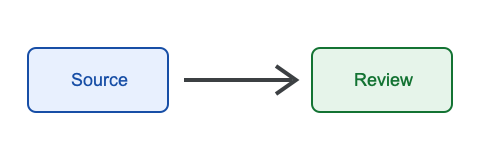
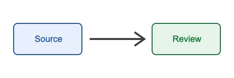
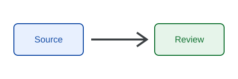

# Media and Layout Acceptance

This acceptance-only member checks raster images, SVG import, code, a wide table, and a landscape section.

## PNG figure



## JPEG figure



## SVG figure



## Code sample

```go
func stableTarget(publicationID string) string {
    return "publication:" + publicationID
}
```

## Wide table

| Control | DOCX | Google | Owner | Evidence | Result |
|---|---|---|---|---|---|
| Cover | Required | Required | Release reviewer | Rendered first page | Pass |
| Sections | Required | Verify | Release reviewer | Portrait and landscape pages | Pass |
| Tables | Required | Verify | Release reviewer | Repeated header and wrapping | Pass |
| Figures | Required | Verify | Release reviewer | PNG, JPEG, and SVG | Pass |
| Links | Required | Verify | Release reviewer | Static TOC and heading links | Pass |
